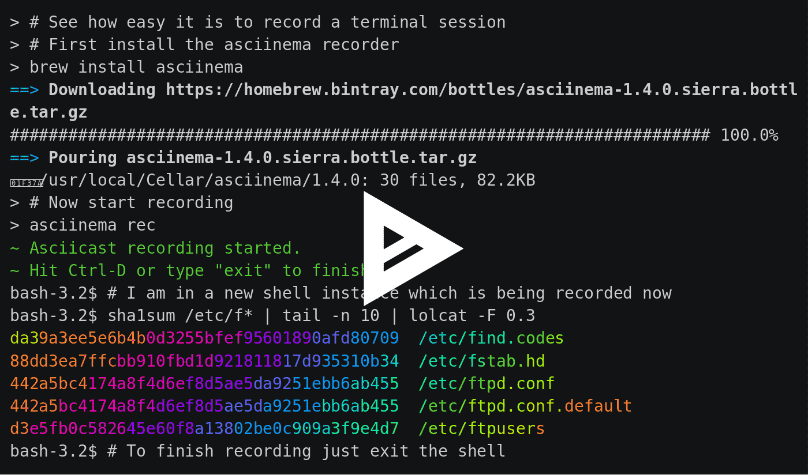

[](https://www.youtube.com/embed/n6OzFDZl-98)

# WIREGUARD VPN SETUP & CONFIG AUTOMATION

Auto setup & config Wireguard VPN for CentOS 7,8 and Ubuntu Server

## PREPARE
Change these parameters to match your setup

- MAX_CLIENTS="5" # Number of client config will be generated
- SERVER_IP="192.168.0.10" # Your server public IP Adress that client will connect to
- SERVER_PORT="56789" # Define port that VPN Service will listen on (UDP)
- DEVICE="ens192" # Name of the network interface corresponding to SERVER_IP (used in iptables NAT rule)
- DISABLE_SELINUX="0" # CHANGE to 1: If you want to disable selinux (CentOS)
- DISALBE_FIREWALLD="0" # CHANGE to 1: If you want to disable Firewalld (CentOS)
- TUNNEL_ADDR_PREFIX="10.8.0" # Local IP address for client after connect to VPN Server
- ROUTES="0.0.0.0/0" # Define ip addresses that will be routed through VPN Tunnel (0.0.0.0/0 mean ALL traffic)

## USAGE
After change default variables, run this command to begin install Wireguard VPN & Config

```bash
bash wireguard_setup.sh
```

When setup completed, VPN client's configuration file will be found at "/etc/wireguard/keys" directory. Just copy "*.conf" file (Example: client1.conf) and import to Wireguard client app to connect

## READ MORE
- https://vietnix.vn/wireguard-la-gi/

Having problem when setup & config Wireguard VPN? Join our Teleram Community (Vietnamese only) at: https://t.me/SinhVienIT for support :)
